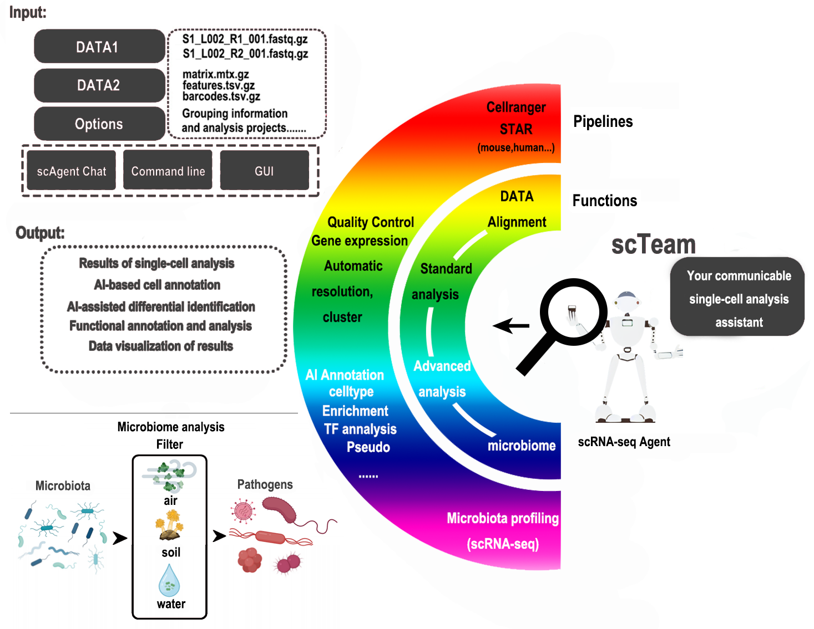
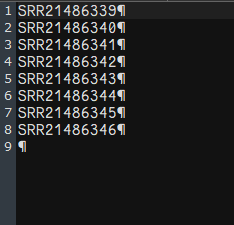
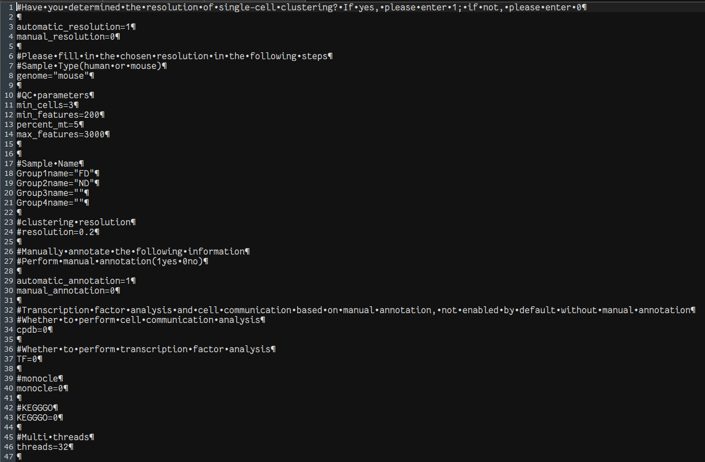
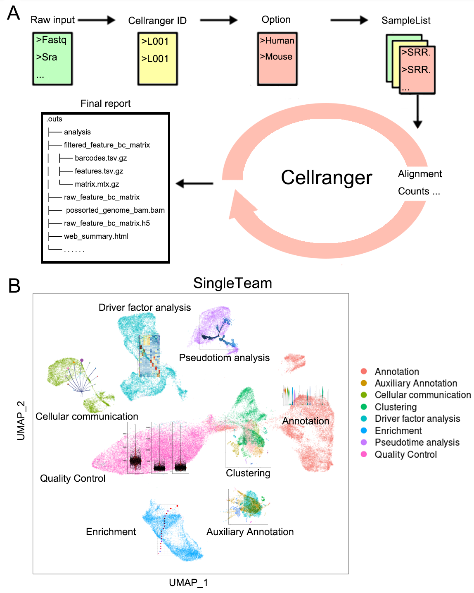
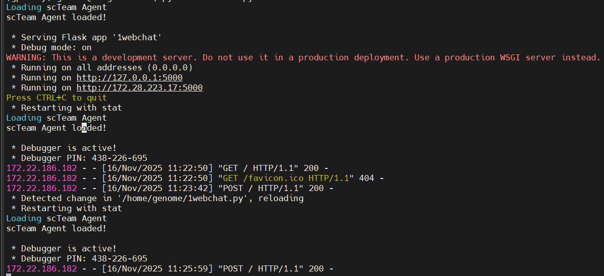
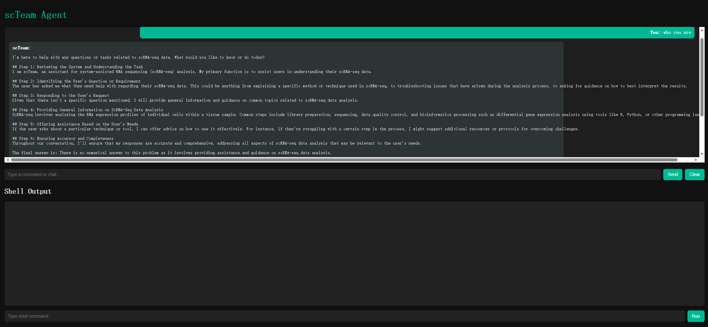

# scTeam
scTeam: A powerful AI- based Pipeline for Automated Single-Cell RNA-seq Analysis and Intratissue Microbial Profiling
  Single-cell RNA sequencing (scRNA-seq) offers a powerful tool for exploring biology and gaining a deeper understanding of health and disease at the single-cell level. However, its analysis remains vastly time-consuming and experience dependent. We developed scTeam, an artificial intelligence (AI)-powered pipeline designed to automate the scRNA-seq data analysis. scTeam provided standard scRNA-seq analyses, including quality control, cell and gene filtering, normalization, identification of highly variable genes, dimension reduction, clustering, cell type annotation, marker gene detection, and differential expression analysis. It also supports advanced analyses, including transcription factor activity, cellular functions, cell–cell communication, and pseudotime analysis. Importantly, empowered by AI, scTeam automatically performs cluster automatically performs clustering resolution optimization, AI-assisted cell-type annotations, and integrated microbiome profiling with single-cell resolution, achieving over 90% annotation accuracy compared to manually fine-tuned annotations. Based on a pre-trained AI model, scTeam efficiently removes potential contamination and enhances identification of low-abundant microbes, enabling intratissue/intratumor microbiota profiling at both pseudo-bulk and single-cell levels. Moreover, distributed as a Docker image with enhanced reproducibility, scTeam allows large-scale and accurate scRNA-seq analysis

The Docker image is hosted at: https://huggingface.co/shuaigeWENHAO/scteam

The reference genomes involved in this study, along with all intermediate result files, are hosted at: https://huggingface.co/shuaigeWENHAO/scTeamBANK

**To run the full pipeline, you need to download both the main Docker package (scteam.gz.part.00–24) and the reference genome package (scTeamBANK.tar.gz.part.01–20)**

First, in the folder where the data are stored, we create the configuration file and the list file as required(scoptions.cfg and scsamplelist.txt).

scsamplelist.txt:A list file containing the sample names is prepared, and the FASTQ files are placed into their corresponding folders.


scoptions.cfg:The configuration file used for the analysis specifies the required analysis types and methods.


After downloading the Docker files, merge them and then extract (decompress) the archive.
```bash
cat scteam.gz.part.* > scteam.tar.gz
tar -xzf scteam.tar.gz
dokcer load -i scteam.tar
```
Perform scRNA-seq analysis starting from FASTQ data.
```bash
docker run --rm -it \
  -v $(pwd):/DATA \
  -v $(pwd)/DATABANK:/DATABANK \
  -p 5000:5000
  scteam:flatten bash /home/code/cellranger.sh
```

Perform single-cell analysis starting from the expression matrix.
```bash
docker run --rm -it \
  -v $(pwd):/DATA \
  -v $(pwd)/DATABANK:/DATABANK \
  -p 5000:5000
  scteam:flatten bash /home/code/scRNA.sh
```



Microbial analysis in single-cell sequencing
```bash
docker run --rm -it \
  -v $(pwd):/DATA \
  -v $(pwd)/DATABANK:/DATABANK \
  -p 5000:5000
  scteam:flatten bash /home/code/scmicrobio.sh
```
Full-process analysis based on AI agents
```bash
docker run --rm -it \
  -v $(pwd):/DATA \
  -v $(pwd)/DATABANK:/DATABANK \
  -p 5000:5000
  scteam:flatten python /home/code/scteamagent.py
```



